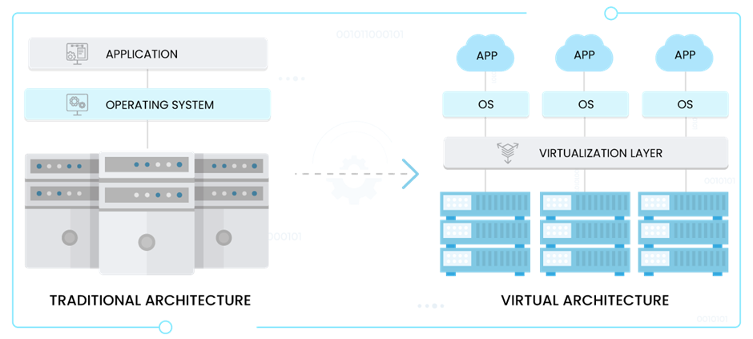
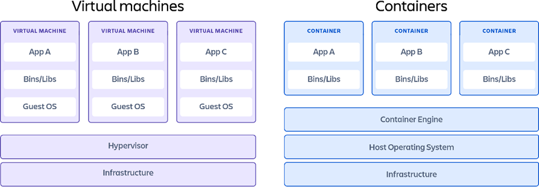

# Virtualization

Nowadays everybody’s talking about (and using) containers for software integration and running
apps on these isolated light-weight environments that turn out to be super convenient. Before even
understanding what all this really is, it’s better to go back a bit to understanding what a virtual
machine is, and even further, what virtualization is.

## What is virtualization

When somebody turns on a computer, this neat graphical interface shows up, with icons and
buttons you can click on. This is the Operating System, and the popular OS distributions are
Windows and MacOS.

Knowing what an OS is, it’s time to understand that virtualization is the process of running an
operating system on top of a virtualization layer. Instead of a traditional OS where it interfaces with
the physical components of a computer (Memory, CPU).

Figure 1 shows the difference between a traditional architecture and a virtual architecture or
virtual machine.

> Figure 1: Virtualization. (Containerization vs. virtualization: 7 technical differences, 2022)

The Virtual Architecture has an interesting layer, “Virtualization layer”. This layer is also called a hypervisor, and it’s the core of virtualization, what really enables containers and virtual machines as we know them.

## Hypervisor

A hypervisor is a computer programme or software that facilitates to create and run multiple virtual machines. It is also known as Virtual Machine Manager (VMM). (Alam, Kumar, & Gour, 2021)

Hypervisor software facilitates virtualization. A hypervisor sits on top of an operating system. But, we can also have hypervisors that are installed directly onto the hardware. (Baeldung on Computer Science, 2020)

## Virtual Machine

Virtualization (Virtual Machine) aims to run multiple OS instances on a single server, whereas containerization runs a single OS instance, with multiple user spaces to isolate processes from one another. (Containerization vs. virtualization: 7 technical differences, 2022)

Virtual machine’s downside, as compared to containerization, is the relatively large overhead associated with virtualization. This is because each VM is running a complete OS kernel, each with their own dedicated memory and each using up a percentage of your CPU to mostly do a lot of the same things.

## Container

Containerization, by comparison, also allows the running of several different isolated services on one machine, but within containers rather than full virtual machines. (Gerenser, 2020) Containers are lightweight software packages that contain all the dependencies required to execute the contained software application. (Containers vs virtual machines, 2022)

## Machine virtualization vs Containerization

Figure 2: Virtual Machine vs Container. (Containers vs virtual machines, 2022) 

In Figure 2 it’s noticeable that on the container diagram, we don’t seem to have a hypervisor, instead we have a container engine which needs a host operating system to run on. However usually a container engine relies on a hypervisor, such as the Docker engine relies on Windows hypervisor.

That’s the main difference between containers and virtual machines on the architecture. In both architectures, apps are isolated, virtual machines are more customizable, but containers are more light-weighted.

# Conclusion

Virtual Machines and containers are alike in that they use virtualization to create isolated environments that don’t interface directly with the hardware. They are widely used due to their easy manageability for lack of hardware set up that is consuming in traditional architectures.

They key difference between the two though, is that the latter isolates environment within a single Host OS, whereas VM technology needs ne instances for having isolated environments.

Virtualization
Nowadays everybody’s talking about (and using) containers for software integration and running apps on these isolated light-weight environments that turn out to be super convenient. Before even understanding what all this really is, it’s better to go back a bit to understanding what a virtual machine is, and even further, what virtualization is.
What is virtualization
So, when somebody turns on a computer, this neat graphical interface shows up, with icons and buttons you can click on. This is the Operating System, and the popular OS distributions are Windows and MacOS.
Knowing what an OS is, it’s time to understand that virtualization is the process of running an operating system on top of a virtualization layer. Instead of a traditional OS where it interfaces with the physical components of a computer (Memory, CPU).
Figure 1 shows the difference between a traditional architecture and a virtual architecture or virtual machine.
 
Figure 1: Virtualization. (Containerization vs. virtualization: 7 technical differences, 2022)
The Virtual Architecture has an interesting layer, “Virtualization layer”. This layer is also called a hypervisor, and it’s the core of virtualization, what really enables containers and virtual machines as we know them.
Hypervisor
A hypervisor is a computer programme or software that facilitates to create and run multiple virtual machines. It is also known as Virtual Machine Manager (VMM). (Alam, Kumar, & Gour, 2021)
Hypervisor software facilitates virtualization. A hypervisor sits on top of an operating system. But, we can also have hypervisors that are installed directly onto the hardware. (Baeldung on Computer Science, 2020)
Virtual Machine
Virtualization (Virtual Machine) aims to run multiple OS instances on a single server, whereas containerization runs a single OS instance, with multiple user spaces to isolate processes from one another. (Containerization vs. virtualization: 7 technical differences, 2022)
Virtual machine’s downside, as compared to containerization, is the relatively large overhead associated with virtualization. This is because each VM is running a complete OS kernel, each with their own dedicated memory and each using up a percentage of your CPU to mostly do a lot of the same things.
Container
Containerization, by comparison, also allows the running of several different isolated services on one machine, but within containers rather than full virtual machines. (Gerenser, 2020) Containers are lightweight software packages that contain all the dependencies required to execute the contained software application. (Containers vs virtual machines, 2022)
Machine virtualization vs Containerization
 
Figure 2: Virtual Machine vs Container. (Containers vs virtual machines, 2022) 
In Figure 2 it’s noticeable that on the container diagram, we don’t seem to have a hypervisor, instead we have a container engine which needs a host operating system to run on. However usually a container engine relies on a hypervisor, such as the Docker engine relies on Windows hypervisor.
That’s the main difference between containers and virtual machines on the architecture. In both architectures, apps are isolated, virtual machines are more customizable, but containers are more light-weighted.
Conclusion
Virtual Machines and containers are alike in that they use virtualization to create isolated environments that don’t interface directly with the hardware. They are widely used due to their easy manageability for lack of hardware set up that is consuming in traditional architectures.
They key difference between the two though, is that the latter isolates environment within a single Host OS, whereas VM technology needs ne instances for having isolated environments.

 
# References
• Alam, Z., Kumar, V., & Gour, S. (2021). A review paper on hypervisor and virtual machine security. Journal of Physics: Conference Series, 1950.

• Baeldung on Computer Science. (2020, October 19). Retrieved from Virtualization vs containerization: https://www.baeldung.com/cs/virtualization-vs-containerization

• Containerization vs. virtualization: 7 technical differences. (2022, 11 15). Retrieved from Trianz: https://www.trianz.com/insights/containerization-vs-virtualization

• Containers vs virtual machines. (2022, November 16). Retrieved from Atlassian: https://www.atlassian.com/microservices/cloud-computing/containers-vs-vms

• Gerenser, S. (2020). Containerization as an Alternative to Virtualization. Radio world, 44, 29.

